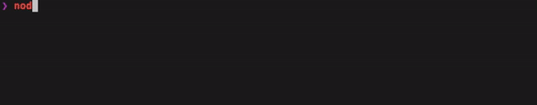

# Prettier check project

Format staged or project files with prettier.

[](https://github.com/jsenv/jsenv-prettier-check-project/packages)
[](https://www.npmjs.com/package/@jsenv/prettier-check-project)
[](https://github.com/jsenv/jsenv-prettier-check-project/actions?workflow=ci)
[](https://codecov.io/gh/jsenv/jsenv-prettier-check-project)

# Table of contents

- [Presentation](#Presentation)
- [Installation](#Installation)
- [Documentation](#Documentation)
  - [formatWithPrettier](#formatWithPrettier)

# Presentation

This package was designed to:

- format staged files with prettier, prefect in a precommit hook.



- get an overwiew of your files state regarding prettier formatting.


- format your project files at once.


# Installation

```console
npm install @jsenv/prettier-check-project@5.1.0
```

```js
const { formatWithPrettier } = require("@jsenv/prettier-check-project")

formatWithPrettier({
  projectDirectoryUrl: "file:///directory",
})
```

# Documentation

## formatWithPrettier

`formatWithPrettier` is an async function collecting files to format them with prettier. It also logs progression and return summary and report objects.

```js
import { formatWithPrettier } from "@jsenv/prettier-check-project"

const { summary, report } = await formatWithPrettier({
  projectDirectoryUrl: "file:///Users/you/directory",
  prettierIgnoreFileRelativeUrl: ".prettierignore",
  projectFilesConfig: {
    "./src/": true,
    "./*": true,
  },
})
```

— source code at [src/formatWithPrettier.js](./src/formatWithPrettier.js).
